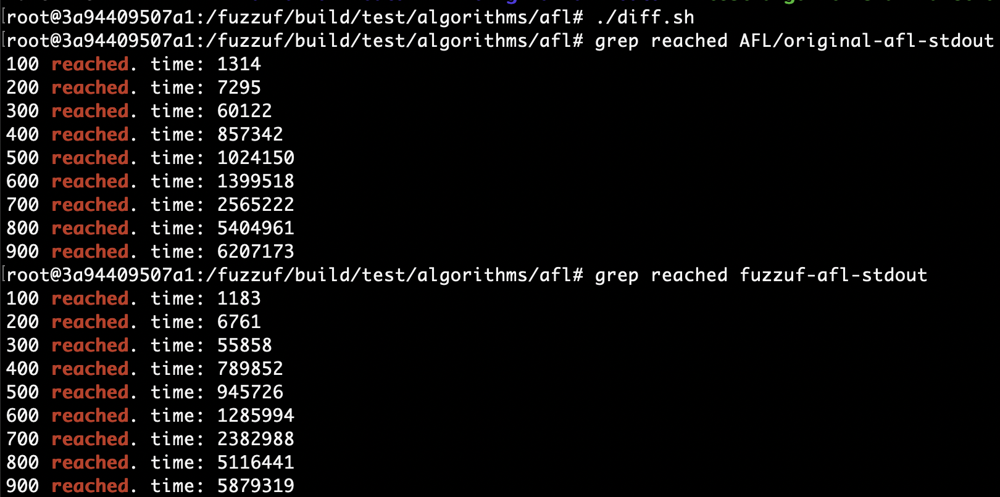

# An artifact that ensures that fuzzuf works consistently with AFL

## What's this branch for?

This branch is for testing whether our implementation of AFL (hereinafter called fuzzuf-AFL) is consistent with the original AFL (original-AFL), and for measuring and comparing their performances.

To this end, we first apply patches to fuzzuf-AFL and original-AFL both, to eliminate all the probabilistic behaviors such as seeding PRNGs with `/dev/urandom`, or estimating the importance of inputs from execution time. You can check patches to fuzzuf-AFL in the top commit, and patches to original-AFL in `test/algorithms/afl/original-afl.patch` .

## The targeted version of original-AFL

The version of original-AFL we currently use is 2.57b.
Especially, we pull the commit `61037103ae3722c8060ff7082994836a794f978e` from https://github.com/google/AFL/ .

If you know some big change is made in original-AFL or think this commit is too outdated, please let us know.

## Changes we apply

Our patches contain the following changes: 
 
  - Originally, the function `UR`, which returns an integer chosen almost uniformly randomly, is regularly seeded with `/dev/urandom`. We delete this part. We also call `srandom(0)` at the beginning to use the same seed.
  - Originally, in `calc_score`, the value of `perf_score` is determined based on execution time. We use a random number drawn from `UR` instead(note that values returned from `UR` are now "deterministic").
  - Originally, in `update_bitmap_score`, whether seeds are favorite or not is determined based on execution time. We use a random number drawn from `UR` instead.
  - In some places of havoc, multiple values drawn from `UR` are passed as arguments to a function. Since the order of evaluation of function arguments is not defined, we modify such function calls to fix the order.
  - We modify the comparison function of `extras` and `a_extras` to avoid the case where there are entries that have the same order, but that have different values(this is required since fuzzuf-AFL uses `std::sort` whereas original-AFL uses `qsort`).
  - We add logging in the part of saving a new seed under `out_dir/queue/`. The logging emits the elapsed time every time AFLs newly save 100 seeds, so this can be used to check the performances of AFLs. 
      * Also, when AFLs find that they generate 900 seeds here, they exit immediately to stop the measurement.
      * This means we can't say "fuzzuf-AFL has no bug at all" because undiscovered bugs may come out by setting this parameter to 1000, 1100, and so on. It is, however, almost impossible.
      * We would highly appreciate it if you locally run this test with such settings and share the results.
      * Note that if you set this parameter to more than 900, the test is likely to last for tens of hours (we already tried some of those values). 

Please let us know if you find other parts that need fixing to get a deterministic result(i.e. to prevent AFLs from generating different outputs every time we run them) or something unfair that makes measuring performances meaningless.

## How the test is done

You can understand how the test is done by seeing `test/algorithms/afl/run.sh` and `test/algorithms/afl/diff.sh`. 

In a nutshell, we take the following steps:

 1. Pull original-AFL by `git submodule add https://github.com/google/AFL/` .
 2. Build fuzzuf using CMake (in Release mode).
 3. Execute `nohup (build_dir)/test/algorithms/afl/run.sh &` . This script
     - applies a patch to original-AFL.
     - builds original-AFL.
     - executes original-AFL.
     - executes fuzzuf-AFL after original-AFL finishes.
 4. Execute `(build_dir)/test/algorithms/afl/diff.sh` to see
     - whether there are different seeds in `(out_dir)/queue/`
     - whether there are different words in `(out_dir)/queue/.state/auto_extras/`
     - whether there are different file names in `(out_dir)/queue/.state/{deterministic_done, redundant_edges, variable_behavior}/`
 5. Check stdout to compare performances.

## Test result

We conducted this experiment in the following environment:
  - Intel Xeon Gold 6238R (2.20 GHz, 28Core)
      * Note that, of course, AFLs use only one of those cores.
  - Ubuntu 18.04 (as a docker container)
  - gcc (Ubuntu 9.3.0-17ubuntu1~20.04) 9.3.0
  - cmake version 3.16.3
  - GNU Make 4.2.1

The above screenshot shows that original-AFL and fuzzuf-AFL generate exactly the same files at least until they generate 900 seeds, and that fuzzuf-AFL is about 5% faster than original-AFL.
